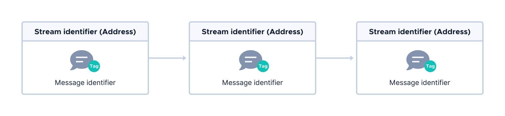

# Core concepts

**This article explains the core concepts of Channels. Before you start working with Channels, you should get to know the core concepts to understand how applications are built.**

## Roles

In Channels, participants can have one of two roles:

- Author
- Subscriber

### Author

Authors are devices that are responsible for the following:

- Creating a channel
- Controlling subscribers' access to private messages
- Signing messages to prove ownership of the channel
- Revoking subscribers' access to the channel

### Subscriber

Subscribers are devices that can do the following:

- Read messages on a channel
- Authenticate messages to make sure they were sent by the trusted author
- Request access to private message
- Send messages on the channel

## Channels messages

Channels are messages that are linked to one another by their [stream identifiers and message identifiers](../introduction/core-concepts.md).

On the Tangle, the stream identifier is the address of a transaction, and the message identifier is the tag of the transaction. Together, these identifiers are called the link.



The channel address is the same for all messages in a channel so that authors and subscribers can find messages on the same channel. The message identifier is different for each new message so that authors and subscribers can still differentiate messages that they've already read from new ones to avoid reading the same message twice.

## Merkle tree

Channels uses Winternitz [one-time signatures](https://en.wikipedia.org/wiki/Hash-based_cryptography#One-time_signature_schemes) (W-OTS) to allow authors to prove ownership of a channel. This signature scheme is quantum robust, meaning that signatures are resistant to attacks by quantum computers. But, the scheme also reveals an unknown amount of the private key that's used to sign messages. As a result, it's safe to sign the same message with the same private key only once. Signing different messages with the same private key allows attackers to forge a signature in their own messages on the channel.

To make sure that each message in a channel has the same channel address, the address is derived from a [Merkle tree signature scheme (MSS)](https://en.wikipedia.org/wiki/Merkle_signature_scheme).

In Channels, the root of the Merkle tree is the channel address and the leaves are the public keys.

This Merkle tree is generated by hashing the author's pre-generated public keys.


By generating a Merkle tree, the author can prove ownership of the channel by doing the following:

- Signing each channel message with a different private key that belongs to one of the public key leaves
- Sending enough of the Merkle tree in the signed message to allow subscribers to validate the signature

The number of public keys that are pre-generated depends on the height of the Merkle tree.

When you create a new instance of the `Author` object, you have the option to decide the height of your author's Merkle tree. Here, the second argument indicates the height of the author's Merkle tree.

```rust
let mut author = Author::new("AUTHORSECRET", 2, true);
```

The height of a Merkle tree affects how many leaves it has, and thus how many messages the author can sign. The total number of key pairs is 2<sup>height</sup>.

Before creating a new channel, it's important to decide how many messages you want to be able to sign before running out of private keys.

However, if you do run out of private keys, you can send a signed [`ChangeKey`](../references/message-types.md#changekey) message, which generates a new Merkle tree that allows you to continue sending signed messages on the same channel.

