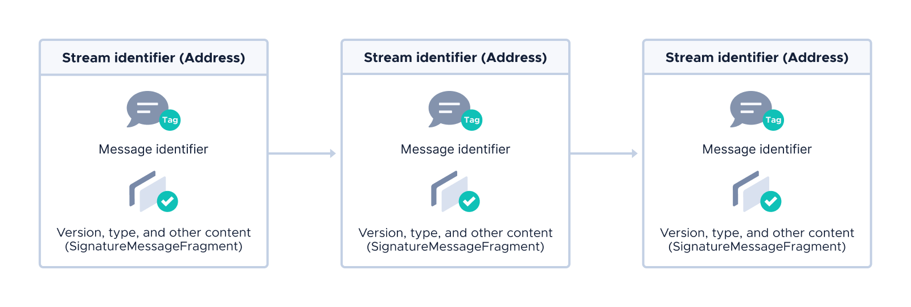

# Core concepts

**This article explains the core concepts of Streams. Before you start working with Streams, you should get to know the core concepts to understand how applications are built.**

## Application structure

Streams applications use a message-oriented protocol, where each message consists of a header and application-specific content.

Messages are written in the [Protobuf3](#protobuf3-messaging) syntax and are processed according to Protobuf3 rules that define both the roles of the application's users and the application's message types.

To publish messages in Streams applications, you use the `transport` module, which includes a Tangle-specific module for converting messages into [bundles](root://getting-started/0.1/transactions/bundles.md) and converting bundles back into messages.

## Protobuf3 messaging

Protobuf3 is a cryptographic message definition language that we built for encoding and decoding Streams messages.

Protobuf3 builds on the idea of [Protocol Buffers](https://en.wikipedia.org/wiki/Protocol_Buffers) by adding keywords that indicate how a certain message field should be processed. For example, the `mssig` keyword indicates that the content contains a signature that must be generated or verified.

Protobuf3 is highly extensible so that it's easy to add new keywords such as those for Diffie-Hellman signatures.

## Transaction structure

As the name suggests, Streams is a framework that offers tools for sending streams of authenticated data.

To allow others to find transactions in a stream, each transaction has a header, which includes the following identifable information:

- **Stream identifier:** This information is stored in the `address` field of a transaction, and is **the same** for each transaction in the same stream
- **Message identifier:** This information is stored in the `tag` field of a transaction, and is **different** for each new message in the same stream

When a transaction relies on information in others with certain message identifiers, it can reference those message identifiers in its message body to form a path that others can follow through the Tangle.

The rest of the header is stored in the first few trytes of the `signatureMessageFragment` field, which are encoded as Protobuf3 messages:

- **Streams version:** The Streams version that was used to create and encode the message
- **Streams message type:** The type of message content, which gives the receiver an indication of how to decode it

The rest of the application-specific content is stored in the `signatureMessageFragment` fields.

